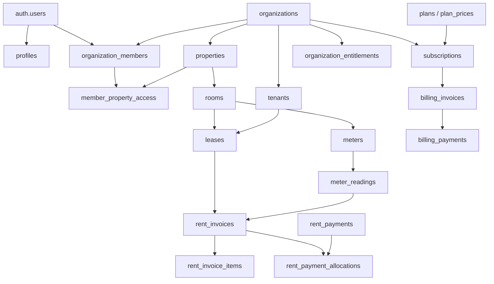

# แผนฐานข้อมูลและ Subscription สำหรับ Longtua Apartment

เอกสารนี้ออกแบบจากขอบเขตเดโมปัจจุบัน โดยตั้งต้นว่าใช้ Next.js, Supabase Auth/PostgreSQL และ Cloudflare R2 สำหรับไฟล์เอกสาร

บัญชีลูกค้าใช้ `username + password` บนหน้าจอ โดย server map username ไปยัง synthetic email ที่ไม่เปิดเผย แล้วให้ Supabase Auth ดูแล password hash, session, JWT และ RLS ต่อไป ลูกค้าจึงไม่ต้องกรอกหรือยืนยันอีเมล

## 1. หลักการสำคัญ

- หน่วยลูกค้า (tenant ของ SaaS) คือ `organization` หรือกิจการ
- หนึ่งกิจการมีหลายหอพัก (`properties`) และหลายผู้ใช้งาน
- ทุกตารางข้อมูลธุรกิจต้องมี `organization_id` เพื่อบังคับการแยกข้อมูลด้วย RLS
- บิลค่าเช่าผู้เช่าใช้ชื่อ `rent_invoices`; บิลค่าสมาชิกระบบใช้ `billing_invoices` ห้ามใช้ตารางเดียวกัน
- จำนวนเงินใช้ `numeric(12,2)` และเวลาทั้งหมดใช้ `timestamptz`
- เอกสารการเงินและ audit log ไม่ลบจริง ให้เปลี่ยนสถานะเป็น `void` หรือ `cancelled`
- การเปลี่ยนสถานะ Subscription ต้องมาจาก webhook ที่ตรวจลายเซ็นแล้ว หรือ reconciliation job เท่านั้น

## 2. ภาพรวมความสัมพันธ์



## 3. ตารางฐานข้อมูล

### 3.1 Identity และ Multi-tenancy

| ตาราง | หน้าที่ | ฟิลด์หลัก |
|---|---|---|
| `auth_login_aliases` | mapping ฝั่ง server จาก username ไป synthetic email ของ Supabase Auth | `username`, `auth_user_id`, `internal_email` |
| `profiles` | โปรไฟล์ที่ผูกกับ Supabase Auth | `id = auth.users.id`, `username`, `display_name`, `phone`, `locale` |
| `organizations` | กิจการที่เป็นลูกค้าของระบบ | `id`, `legal_name`, `display_name`, `tax_id`, `billing_email`, `status`, `owner_user_id` |
| `organization_members` | ผู้ใช้และ Role ภายในกิจการ | `organization_id`, `user_id`, `role_code`, `status`, `invited_at`, `joined_at` |
| `member_property_access` | จำกัดพนักงานให้เห็นเฉพาะบางหอ | `organization_member_id`, `property_id` |
| `roles` | Role ที่มากับระบบหรือสร้างเอง | `organization_id nullable`, `code`, `name`, `is_system` |
| `role_permissions` | Permission matrix | `role_id`, `permission_code`, `allowed` |
| `invitations` | คำเชิญผู้ใช้งาน | `organization_id`, `email`, `role_code`, `token_hash`, `expires_at`, `accepted_at` |

Role เริ่มต้น: `owner`, `accounting`, `staff` ส่วน `super_admin` เป็นสิทธิ์ของทีม Longtua และไม่ควรอยู่ใน membership ของลูกค้า

### 3.2 หอพักและผู้เช่า

| ตาราง | หน้าที่ | ฟิลด์หลัก |
|---|---|---|
| `properties` | หอพักแต่ละแห่ง | `organization_id`, `name`, `address`, `phone`, `timezone`, `status` |
| `property_settings` | ค่าไฟ ค่าน้ำ วันออกบิล และ PromptPay | `property_id`, `electric_rate`, `water_rate`, `bill_day`, `due_day`, `late_fee`, `promptpay_id`, `account_name` |
| `rooms` | ห้องพัก | `organization_id`, `property_id`, `room_number`, `floor`, `base_rent`, `status` |
| `tenants` | บุคคลผู้เช่า | `organization_id`, `full_name`, `id_card_ciphertext`, `phone`, `email`, `status` |
| `leases` | สัญญาเช่า | `organization_id`, `property_id`, `room_id`, `primary_tenant_id`, `lease_number`, `start_date`, `end_date`, `rent_amount`, `deposit_amount`, `advance_amount`, `status`, `terms_snapshot` |
| `lease_occupants` | ผู้พักร่วมในสัญญา | `lease_id`, `tenant_id`, `relationship`, `is_primary` |
| `documents` | metadata ของไฟล์ใน R2 | `organization_id`, `entity_type`, `entity_id`, `bucket`, `object_key`, `mime_type`, `size_bytes`, `checksum` |

ข้อมูลบัตรประชาชนไม่ควรเก็บเป็น plain text หากไม่จำเป็นควรเก็บเฉพาะเลขท้าย 4 หลัก; หากจำเป็นต้องใช้เอกสาร ให้เข้ารหัสและจำกัดสิทธิ์เฉพาะ Owner

### 3.3 มิเตอร์และบิลค่าเช่า

| ตาราง | หน้าที่ | ฟิลด์หลัก |
|---|---|---|
| `meters` | มิเตอร์ต่อห้องและประเภท | `organization_id`, `property_id`, `room_id`, `meter_type`, `serial_number`, `active_from`, `active_to` |
| `billing_cycles` | รอบบิลของหอ | `organization_id`, `property_id`, `period_month`, `status`, `generated_at`, `closed_at` |
| `meter_readings` | เลขมิเตอร์ในแต่ละรอบ | `organization_id`, `meter_id`, `billing_cycle_id`, `previous_value`, `current_value`, `usage`, `read_at`, `read_by` |
| `rent_invoices` | หัวใบแจ้งหนี้ผู้เช่า | `organization_id`, `property_id`, `billing_cycle_id`, `lease_id`, `room_id`, `invoice_number`, `issued_at`, `due_at`, `subtotal`, `total`, `balance_due`, `status` |
| `rent_invoice_items` | ค่าเช่า ค่าไฟ ค่าน้ำ ค่าปรับ | `rent_invoice_id`, `item_type`, `description`, `quantity`, `unit_price`, `amount`, `metadata` |
| `rent_payments` | เงินที่รับจากผู้เช่า | `organization_id`, `property_id`, `receipt_number`, `paid_at`, `amount`, `method`, `reference`, `evidence_document_id`, `status` |
| `rent_payment_allocations` | จัดสรรหนึ่ง payment ไปหลาย invoice | `rent_payment_id`, `rent_invoice_id`, `amount` |

ยอดค้างไม่ต้องมีตารางแยก ให้คำนวณจาก `rent_invoices.balance_due > 0` และสร้าง materialized view ภายหลังเมื่อข้อมูลมีขนาดใหญ่

### 3.4 LINE และระบบติดตาม

| ตาราง | หน้าที่ | ฟิลด์หลัก |
|---|---|---|
| `line_integrations` | การเชื่อม LINE OA ต่อกิจการ/หอ | `organization_id`, `property_id nullable`, `channel_id`, `secret_ciphertext`, `status` |
| `notification_campaigns` | แคมเปญส่งบิล/เตือนยอด | `organization_id`, `property_id`, `campaign_type`, `scheduled_at`, `status` |
| `notification_deliveries` | ผลส่งรายผู้เช่า | `campaign_id`, `tenant_id`, `rent_invoice_id`, `provider_message_id`, `status`, `sent_at`, `error_code` |
| `audit_logs` | ประวัติการเปลี่ยนแปลง | `organization_id`, `actor_user_id`, `action`, `entity_type`, `entity_id`, `before_data`, `after_data`, `ip_address`, `created_at` |

## 4. ตารางแพ็กเกจและการคิดเงิน SaaS

| ตาราง | หน้าที่ | ฟิลด์หลัก |
|---|---|---|
| `plans` | ชื่อและสถานะแพ็กเกจ | `code`, `name`, `description`, `is_public`, `active_from`, `retired_at` |
| `plan_prices` | ราคาแบบ versioned | `plan_id`, `currency`, `interval`, `amount`, `provider_price_id`, `active_from`, `retired_at` |
| `plan_limits` | ขีดจำกัดแพ็กเกจ | `plan_id`, `limit_code`, `limit_value` เช่น `properties`, `rooms`, `users` |
| `features` | รายการ feature | `code`, `name` เช่น `reports`, `line`, `audit_export` |
| `plan_features` | feature ที่รวมใน plan | `plan_id`, `feature_id`, `enabled`, `quota` |
| `billing_customers` | mapping กิจการกับผู้ให้บริการจ่ายเงิน | `organization_id`, `provider`, `provider_customer_id` |
| `subscriptions` | สถานะ trial/สมาชิกปัจจุบัน | `organization_id`, `plan_price_id`, `provider`, `provider_subscription_id`, `status`, `trial_started_at`, `trial_ends_at`, `current_period_start`, `current_period_end`, `grace_ends_at`, `access_until`, `cancel_at_period_end` |
| `subscription_addons` | Add-on เช่น LINE | `subscription_id`, `feature_id`, `provider_subscription_item_id`, `quantity`, `status` |
| `organization_entitlements` | สิทธิ์ที่ระบบอ่านได้เร็ว | `organization_id`, `feature_code`, `enabled`, `quota`, `source`, `valid_until` |
| `billing_invoices` | บิลค่าสมาชิก Longtua | `organization_id`, `subscription_id`, `provider_invoice_id`, `number`, `amount_due`, `amount_paid`, `currency`, `status`, `due_at`, `paid_at` |
| `billing_payments` | ผลการจ่ายค่าสมาชิก | `billing_invoice_id`, `provider_payment_id`, `amount`, `method`, `status`, `paid_at` |
| `billing_webhook_events` | กัน webhook ซ้ำและเก็บผลประมวลผล | `provider`, `provider_event_id`, `event_type`, `payload`, `received_at`, `processed_at`, `status`, `last_error` |
| `trial_claims` | ป้องกันทดลองใช้ฟรีซ้ำ | `organization_id`, `owner_user_id`, `normalized_username`, `normalized_phone`, `claimed_at` |

`subscriptions.status` ที่ระบบรองรับ:

- `trialing`: ใช้งานช่วงทดลอง
- `active`: ชำระแล้ว
- `past_due`: ต่ออายุไม่สำเร็จ แต่อยู่ใน grace period
- `readonly`: หมด trial หรือ grace period แก้ไขข้อมูลไม่ได้
- `paused`: หยุดคิดเงินและหยุดสร้างรอบใหม่
- `cancelled`: ยกเลิกแล้ว แต่ยังเก็บข้อมูลตามนโยบาย

อย่าใช้สถานะจากหน้าจอเป็นตัวตัดสินสิทธิ์โดยตรง ให้เรียกฟังก์ชันกลาง เช่น `private.organization_access_state(organization_id)` ที่ดู `status`, `access_until` และ `grace_ends_at`

## 5. แพ็กเกจตั้งต้นที่แนะนำ

ราคาเป็นสมมติฐานสำหรับทดลองตลาดและต้องเก็บใน `plan_prices` ไม่ hard-code ในหน้าเว็บ

| แพ็กเกจ | ราคา/เดือน | ขีดจำกัดหลัก | กลุ่มเป้าหมาย |
|---|---:|---|---|
| Starter | ฿490 | 1 หอ, 30 ห้อง, 3 ผู้ใช้ | เจ้าของหอขนาดเล็ก |
| Growth | ฿990 | 3 หอ, 100 ห้อง, 10 ผู้ใช้ | ธุรกิจที่กำลังขยาย |
| Business | ฿1,590 | 10 หอ, 300 ห้อง, ผู้ใช้ไม่จำกัด | บริษัทบริหารหลายหอ |
| LINE Add-on | +฿299/กิจการ/เดือน | กำหนด quota ส่งข้อความตามต้นทุนจริง | ลูกค้าที่ต้องการส่งบิลอัตโนมัติ |

แผนรายปีให้ส่วนลดเทียบเท่า 2 เดือนเพื่อเพิ่มเงินสดล่วงหน้า ส่วน over-limit ให้บล็อกการเพิ่มรายการใหม่ แต่ไม่ซ่อนหรือลบข้อมูลเก่า

## 6. นโยบายทดลองใช้ฟรีและเริ่มคิดเงิน

### ช่วงทดลองใช้ฟรี

- 30 วัน ไม่ต้องใส่บัตร
- เริ่มนับหลังสร้างบัญชีและกิจการสำเร็จใน transaction เดียว
- ให้ลอง feature ของ Business แต่จำกัด 2 หอ, 50 ห้อง, 5 ผู้ใช้
- LINE ใช้ sandbox/preview หรือ quota ต่ำ เพื่อไม่ให้ต้นทุนข้อความถูกใช้ในทางผิด
- หนึ่ง trial ต่อ owner + username + เบอร์โทร โดยมีเจ้าหน้าที่หลังบ้าน override ได้ (หน้าจอ Super Admin ไม่อยู่ใน demo ลูกค้า)
- แจ้งเตือนก่อนหมดอายุ 7, 3 และ 1 วัน

### เมื่อ Trial หมด

1. เปลี่ยนเป็น `readonly` ทันที: ดูข้อมูล พิมพ์เอกสาร และ Export ได้ แต่เพิ่ม/แก้ไขไม่ได้
2. แสดงหน้าชำระเงินทุกครั้งที่พยายามทำรายการเขียน
3. เก็บข้อมูลอย่างน้อย 90 วันตามนโยบายที่ประกาศกับลูกค้า
4. เมื่อชำระสำเร็จ เปลี่ยนเป็น `active` ผ่าน webhook และปลดล็อกทันที

### การต่ออายุ

- บัตร: charge อัตโนมัติทุกเดือน/ปี
- PromptPay: สร้าง invoice/QR ให้ลูกค้ายืนยันการจ่ายในแต่ละรอบ; ไม่ควรสมมติว่าเป็น auto-debit
- แจ้งก่อนต่ออายุ 7 วัน
- หากจ่ายไม่สำเร็จ เปลี่ยนเป็น `past_due` และให้ grace period 7 วัน
- ครบ grace period แล้วยังไม่สำเร็จ เปลี่ยนเป็น `readonly`
- ยกเลิกแบบ `cancel_at_period_end`; ลูกค้ายังใช้ได้ถึง `current_period_end`
- Upgrade มีผลทันทีและคิดส่วนต่างตามสัดส่วน; downgrade มีผลรอบถัดไป

## 7. Webhook และ Billing flow

```text
สมัคร/เลือกแพ็กเกจ
  -> server สร้าง Checkout Session พร้อม organization_id ใน metadata
  -> ผู้ให้บริการรับเงิน
  -> webhook ตรวจ signature
  -> insert billing_webhook_events ด้วย provider_event_id แบบ unique
  -> transaction: upsert subscription + invoice + payment + entitlements
  -> commit
  -> ส่งอีเมล/LINE ผ่าน queue
```

Event ขั้นต่ำที่ต้องรองรับ:

- `checkout.session.completed`
- `customer.subscription.created|updated|deleted|paused|resumed`
- `customer.subscription.trial_will_end`
- `invoice.created|paid|payment_failed|payment_action_required`

มี reconciliation job รายวันดึง subscription ที่อัปเดตจาก provider มาเทียบกับฐานข้อมูล เพื่อแก้กรณี webhook หลุด

## 8. Constraint และ Index สำคัญ

```sql
unique (organization_id, property_id, room_number)
unique (organization_id, lease_number)
unique (organization_id, invoice_number)
unique (organization_id, receipt_number)
unique (meter_id, billing_cycle_id)
unique (provider, provider_event_id)
check (current_value >= previous_value)
check (amount >= 0)
```

- Partial unique index: หนึ่งห้องมีสัญญา `active` ได้หนึ่งฉบับ
- Index ทุกตารางด้วย `(organization_id, created_at desc)`
- Index membership ด้วย `(user_id, organization_id)` เพื่อให้ RLS ตรวจเร็ว
- Index ใบแจ้งหนี้ด้วย `(organization_id, status, due_at)`
- Index meter readings ด้วย `(organization_id, meter_id, billing_cycle_id)`
- `version integer` สำหรับ optimistic concurrency ในข้อมูลที่แก้ไขบ่อย

## 9. RLS และความปลอดภัย

- เปิด RLS ทุกตารางใน schema ที่ Data API เข้าถึงได้
- `anon` ไม่มีสิทธิ์อ่านข้อมูลธุรกิจ
- ผู้ใช้ต้องเป็นสมาชิกของ `organization_id` จึงอ่านได้
- การเขียนตรวจทั้ง membership, role permission, property scope และสถานะ Subscription
- `service_role` ใช้เฉพาะ server สำหรับ webhook, cron และงานหลังบ้าน ห้ามส่งไป browser
- สร้าง security-definer helper ใน schema `private` สำหรับตรวจ membership เพื่อเลี่ยง policy recursion
- เขียน pgTAP test ทั้ง allow และ deny: owner, accounting, staff, non-member และ expired organization

## 10. ลำดับการพัฒนา

### Phase 1 — Foundation

- Supabase Auth, `profiles`, `organizations`, membership และ invitations
- RLS helper + policy tests
- onboarding ที่สร้าง organization, owner membership และ trial ภายใน transaction เดียว

### Phase 2 — Apartment Core

- properties, settings, rooms, tenants, leases และ R2 documents
- เปลี่ยนหน้าเดโมแต่ละหน้าให้ดึงข้อมูลจริงทีละ module

### Phase 3 — Rent Billing

- meters, billing cycles, readings, rent invoices/items, payments/allocations
- เลขเอกสารแบบ transaction-safe และการพิมพ์เอกสาร

### Phase 4 — SaaS Billing

- plans, prices, subscriptions, entitlements และ Checkout
- webhook แบบ idempotent, trial expiry, grace period และ reconciliation job

### Phase 5 — Notifications และ Production Hardening

- LINE integration/outbox, audit log, rate limit, backup/restore
- RLS penetration tests, billing tests, observability และ incident runbook

## 11. Definition of Done สำหรับเปิดใช้จริง

- ลูกค้าสมัครด้วย username/password สร้างกิจการ และเริ่ม trial ได้เอง
- สมาชิกต่างกิจการไม่สามารถอ่านหรือเขียนข้อมูลข้ามกันได้ แม้ยิง API โดยตรง
- ออกบิลและรับชำระซ้ำไม่ได้จาก double click หรือ webhook ซ้ำ
- Trial, active, past_due, readonly, cancellation และ reactivation มี automated tests
- มี backup, restore drill, audit log และ alert เมื่อ webhook/cron ล้มเหลว
- ไม่มี secret หรือ service role key อยู่ใน client bundle

## แหล่งอ้างอิงหลัก

- Supabase RLS: https://supabase.com/docs/guides/database/postgres/row-level-security
- Supabase Auth architecture: https://supabase.com/docs/guides/auth/architecture
- Stripe subscription webhooks: https://docs.stripe.com/billing/subscriptions/webhooks
- Stripe trials: https://docs.stripe.com/billing/subscriptions/trials
- Stripe PromptPay: https://docs.stripe.com/payments/promptpay
